# NBA Data Pipeline

A batch ETL pipeline that ingests NBA game data from Parquet files into a normalized SQLite database.

## Quick Start

```bash
# 1. Install dependencies
pip install pandas pyarrow

# 2. Configure file paths (edit config.py)
PARQUET_FILES = {
    'pbp': 'pbp',                    # Directory with play-by-play files
    'boxscore': 'boxscore',          # Directory with boxscore files
    'players': 'players.parquet',    # Single player file
    'schedule': 'schedule.parquet'   # Single schedule file
}

# 3. Run the pipeline
python main.py
```

That's it! Your data is now in `nba.db`.

---

## Architecture

```mermaid
flowchart LR
    subgraph Sources["📁 Source Files"]
        PBP[pbp/*.parquet]
        BOX[boxscore/*.parquet]
        PLAY[players.parquet]
        SCHED[schedule.parquet]
    end
    
    subgraph Extract["🔍 Extract (extract.py)"]
        READ[Read Parquets<br/>Concat Files]
    end
    
    subgraph Transform["⚙️ Transform (transform.py)"]
        DIM[Build Dimensions<br/>• Teams<br/>• Players<br/>• Arenas<br/>• Dates]
        FACT[Build Facts<br/>• Games<br/>• Team Stats<br/>• Player Stats<br/>• Play-by-Play<br/>• Leaders]
    end
    
    subgraph Load["💾 Load (load.py)"]
        MODE{Load Mode?}
        UPSERT[UPSERT<br/>DELETE + INSERT<br/>Idempotent]
        REFRESH[FULL_REFRESH<br/>DROP + CREATE<br/>Destructive]
    end
    
    subgraph Validate["✓ Validate (validate_data.py)"]
        CHECKS[15 Data Quality Checks<br/>• Duplicates<br/>• Referential Integrity<br/>• Missing Data<br/>• Consistency]
    end
    
    subgraph Database["🗄️ SQLite Database"]
        DB[(nba.db<br/>10 Tables<br/>Indexed)]
    end
    
    PBP --> READ
    BOX --> READ
    PLAY --> READ
    SCHED --> READ
    
    READ --> DIM
    READ --> FACT
    
    DIM --> MODE
    FACT --> MODE
    
    MODE -->|config.LOAD_MODE| UPSERT
    MODE -->|config.LOAD_MODE| REFRESH
    
    UPSERT --> DB
    REFRESH --> DB
    
    DB --> CHECKS
    
    style Sources fill:#e1f5ff
    style Extract fill:#fff4e1
    style Transform fill:#ffe1f5
    style Load fill:#e1ffe1
    style Validate fill:#f5e1ff
    style Database fill:#ffe1e1
```



**Data Flow:**
1. **Extract** - Read parquet files (handles both files and directories)
2. **Transform** - Build 4 dimension tables + 6 fact tables in memory
3. **Load** - Write to SQLite using UPSERT (idempotent) or FULL_REFRESH (destructive)
4. **Validate** - Run 15 automated data quality checks

---

## Installation

**Requirements:**
- Python 3.8+
- pandas
- pyarrow

**Setup:**
```bash
# Create virtual environment (recommended)
python -m venv .venv
source .venv/bin/activate  # On Windows: .venv\Scripts\activate

# Install dependencies
pip install pandas pyarrow
```

---

## Usage

### Basic Run
```bash
python main.py
```

### Run with Validation Only
```bash
python validate_data.py
```

### Test Idempotency
```bash
python test_idempotency.py
```
Runs pipeline twice and verifies identical results.

---

## Configuration

Edit `config.py` to customize behavior:

### File Paths
```python
PARQUET_FILES = {
    'pbp': 'pbp',                      # Directory or file
    'boxscore': 'boxscore',            # Directory or file
    'players': 'players.parquet',      # Single file
    'schedule': 'schedule.parquet'     # Single file
}
```

### Load Mode
```python
LOAD_MODE = 'UPSERT'  # or 'FULL_REFRESH'
```

| Mode | Behavior | Use Case |
|------|----------|----------|
| `UPSERT` | DELETE existing records for loaded game_ids, then INSERT | **Default** - Safe for re-runs, incremental loads |
| `FULL_REFRESH` | DROP all tables, recreate schema, load all data | Complete rebuild, testing |

### Validation
```python
RUN_VALIDATION = True  # Run checks after ETL
```

---

## Project Structure

```
nba_etl/
├── config.py           # Configuration (paths, mode, settings)
├── extract.py          # Read parquet files
├── transform.py        # Build dimensions and facts
├── load.py             # Write to SQLite with upsert logic
├── main.py             # Orchestrator (runs extract → transform → load)
├── validate_data.py    # Data quality validation (15 checks)
├── test_idempotency.py # Test safe re-runs
├── DATA_QUALITY.md     # Validation documentation
└── nba.db              # SQLite database (created by pipeline)
```

**Data Model:** See `data_dictionary.md` for complete schema documentation.

---

## Database Schema

**10 Tables:**

**Dimensions (4):**
- `dim_teams` - NBA teams
- `dim_players` - Player attributes
- `dim_arenas` - Venues
- `dim_dates` - Date dimension

**Facts (6):**
- `fact_games` - Game details
- `fact_player_roster` - Player-team assignments
- `fact_team_game_stats` - Team performance per game
- `fact_player_game_stats` - Player performance per game
- `fact_play_by_play` - Detailed game actions
- `fact_game_leaders` - Top performers

**Key Features:**
- Primary key constraints on all tables
- Foreign key relationships enforced
- Indexes on common query patterns

---

## Data Quality

The pipeline includes **15 automated validation checks** across 4 categories:

1. **Duplicate Detection** - Ensures no duplicate records in fact tables
2. **Referential Integrity** - Validates all foreign keys
3. **Missing/Malformed Data** - Checks for nulls, negatives, invalid values
4. **Consistency Checks** - Validates data across related tables

**Documentation:** See `DATA_QUALITY.md` for complete validation approach.

**Sample Output:**
```
✓ [INFO] Play-by-Play Duplicates: No duplicate events
✓ [INFO] Player Stats → Players FK: All references valid
✓ [WARNING] Games with Missing Scores: 1316 future games
✓ [INFO] Game Score vs Team Stats: Scores match

Total Checks: 15 | Passed: 15 | Warnings: 3 | Errors: 0
✓ Data quality acceptable with minor warnings.
```

---

## Sample Queries

```sql
-- Top scorers
SELECT 
    p.first_name || ' ' || p.last_name as player,
    s.points, s.rebounds_total, s.assists
FROM fact_player_game_stats s
JOIN dim_players p ON s.player_id = p.player_id
ORDER BY s.points DESC
LIMIT 10;

-- Games at a specific arena
SELECT 
    g.game_id,
    ht.team_name as home_team,
    at.team_name as away_team,
    g.home_score,
    g.away_score
FROM fact_games g
JOIN dim_arenas a ON g.arena_id = a.arena_id
JOIN dim_teams ht ON g.home_team_id = ht.team_id
JOIN dim_teams at ON g.away_team_id = at.team_id
WHERE a.arena_name = 'Crypto.com Arena';

-- Player performance trend
SELECT 
    d.full_date,
    s.points,
    s.rebounds_total,
    s.assists
FROM fact_player_game_stats s
JOIN fact_games g ON s.game_id = g.game_id
JOIN dim_dates d ON g.game_date_id = d.date_id
WHERE s.player_id = 2544  -- LeBron James
ORDER BY d.full_date DESC;
```

---

## Troubleshooting

### "No parquet files found in {path}"
**Cause:** Directory path is incorrect or empty  
**Fix:** Verify paths in `config.py` match your file locations

### "IntegrityError: UNIQUE constraint failed"
**Cause:** Trying to insert duplicates with LOAD_MODE='UPSERT'  
**Fix:** This shouldn't happen - check if you modified primary keys

### "sqlite3.OperationalError: too many SQL variables"
**Cause:** Table has too many columns for batch insert  
**Fix:** Already handled via `BATCH_SIZE=30`. If still occurring, reduce BATCH_SIZE in config.py

### "Validation failed: Player Stats → Players FK"
**Cause:** Player IDs in boxscore don't exist in players file  
**Fix:** Ensure all source files are from the same data snapshot/date

### Pipeline is slow
**Cause:** Large files or UPSERT mode with many deletes  
**Fix:** Use LOAD_MODE='FULL_REFRESH' for initial loads, then switch to UPSERT for incremental

---

## Performance

**Typical Runtime:**
- Extract: ~2 seconds (84 games)
- Transform: ~3 seconds
- Load (UPSERT): ~5 seconds
- Validation: ~2 seconds
- **Total: ~12 seconds**

**Scaling:**
- Pipeline tested with 84 games (47,797 play-by-play events)
- Expected to handle full NBA season (1,230 games) in under 2 minutes
- SQLite performs well for datasets < 1M rows per table

---

## Development Notes

**Design Principles:**
- ✅ Minimal dependencies (pandas + pyarrow only)
- ✅ Modular architecture (separate extract/transform/load)
- ✅ Idempotent by default (safe re-runs)
- ✅ Defensive null handling throughout
- ✅ No over-engineering

**Future Enhancements:**
- Add incremental load based on game_date
- Support PostgreSQL for production
- Add statistical validation (outlier detection)
- Integrate with dbt for SQL-based transformations