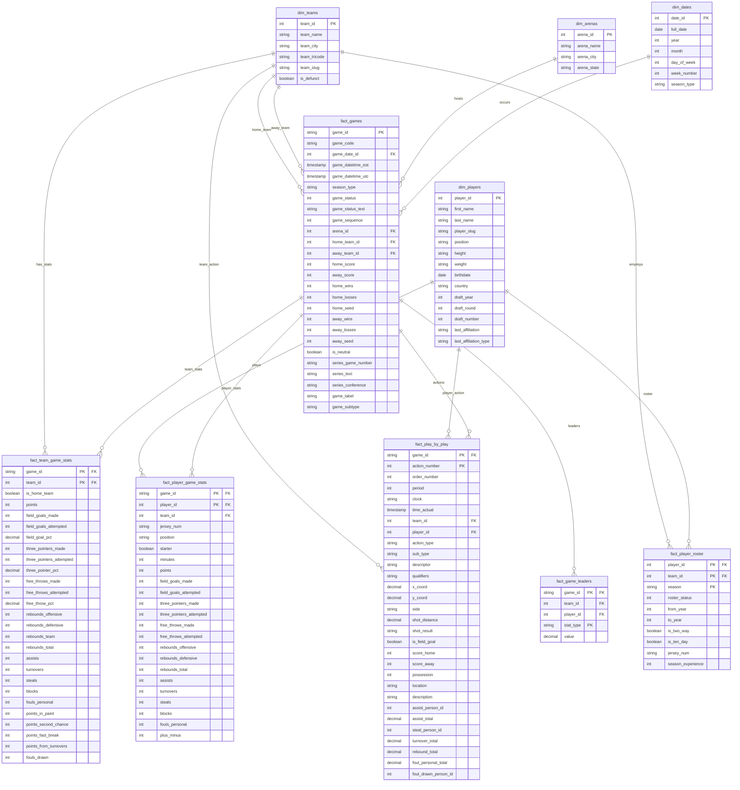

# NBA Data Model - Data Dictionary

## Overview
This data dictionary defines the relational schema for NBA game, player, and play-by-play data. The model supports analytical queries across games, players, teams, and detailed in-game actions.

---

## Dimension Tables

### dim_teams
Dimension table containing all NBA teams (current and historical).

| Column | Data Type | Constraints | Description |
|--------|-----------|-------------|-------------|
| team_id | INT | PK, NOT NULL | Unique team identifier |
| team_name | VARCHAR(100) | NOT NULL | Team name (e.g., "Lakers", "Celtics") |
| team_city | VARCHAR(100) | NOT NULL | Team city (e.g., "Los Angeles", "Boston") |
| team_tricode | VARCHAR(3) | NOT NULL | Three-letter team abbreviation (e.g., "LAL", "BOS") |
| team_slug | VARCHAR(100) | NOT NULL | URL-friendly team identifier |
| is_defunct | BOOLEAN | NOT NULL | Flag indicating if team no longer exists |

**Business Rules:**
- team_id = 0 represents league-level or non-team events
- team_tricode should be unique across active teams

---

### dim_players
Dimension table containing all NBA players (current and historical).

| Column | Data Type | Constraints | Description |
|--------|-----------|-------------|-------------|
| player_id | INT | PK, NOT NULL | Unique player identifier |
| first_name | VARCHAR(100) | NOT NULL | Player's first name |
| last_name | VARCHAR(100) | NOT NULL | Player's last name |
| player_slug | VARCHAR(200) | NOT NULL | URL-friendly player identifier |
| position | VARCHAR(20) | NULL | Primary position (G, F, C, G-F, F-C, etc.) |
| height | VARCHAR(10) | NULL | Height in feet-inches format (e.g., "6-7") |
| weight | VARCHAR(10) | NULL | Weight in pounds |
| birthdate | DATE | NULL | Date of birth |
| country | VARCHAR(100) | NULL | Country of origin |
| draft_year | INT | NULL | Year player was drafted (0 = undrafted) |
| draft_round | INT | NULL | Draft round (0 = undrafted) |
| draft_number | INT | NULL | Overall draft pick number (0 = undrafted) |
| last_affiliation | VARCHAR(200) | NULL | Last college/team before NBA |
| last_affiliation_type | VARCHAR(50) | NULL | Type of affiliation (College, International, etc.) |

**Business Rules:**
- draft_year = 0 indicates undrafted player
- Maintains latest known player attributes (SCD Type 1)

---

### dim_arenas
Dimension table containing all NBA arenas.

| Column | Data Type | Constraints | Description |
|--------|-----------|-------------|-------------|
| arena_id | INT | PK, NOT NULL | Synthetic key for arena |
| arena_name | VARCHAR(200) | NOT NULL | Official arena name |
| arena_city | VARCHAR(100) | NOT NULL | City where arena is located |
| arena_state | VARCHAR(2) | NULL | State/province code (NULL for international) |

**Business Rules:**
- Generated synthetic key based on (arena_name, arena_city, arena_state)

---

### dim_dates
Date dimension for time-based analysis.

| Column | Data Type | Constraints | Description |
|--------|-----------|-------------|-------------|
| date_id | INT | PK, NOT NULL | Date in YYYYMMDD format |
| full_date | DATE | NOT NULL | Actual date value |
| year | INT | NOT NULL | Year |
| month | INT | NOT NULL | Month (1-12) |
| day_of_week | INT | NOT NULL | Day of week (1=Monday, 7=Sunday) |
| week_number | INT | NOT NULL | ISO week number |
| season_type | VARCHAR(50) | NULL | Season type if applicable (Regular, Playoffs, etc.) |

---

## Fact Tables

### fact_player_roster
Tracks player-team relationships over time (SCD Type 2).

| Column | Data Type | Constraints | Description |
|--------|-----------|-------------|-------------|
| player_id | INT | PK, FK, NOT NULL | References dim_players.player_id |
| team_id | INT | PK, FK, NOT NULL | References dim_teams.team_id |
| season | VARCHAR(10) | PK, NOT NULL | Season identifier (e.g., "2024") |
| roster_status | INT | NOT NULL | Roster status code (0=inactive, 1=active) |
| from_year | INT | NOT NULL | First year with organization |
| to_year | INT | NOT NULL | Last year with organization |
| is_two_way | BOOLEAN | NULL | Two-way contract flag |
| is_ten_day | BOOLEAN | NULL | Ten-day contract flag |
| jersey_num | VARCHAR(5) | NULL | Jersey number |
| season_experience | INT | NULL | Years of NBA experience |

**Grain:** One row per player-team-season combination

**Business Rules:**
- Tracks all roster moves including trades, signings, releases
- season_experience can be -1 for rookies without NBA experience

---

### fact_games
Core fact table for all NBA games.

| Column | Data Type | Constraints | Description |
|--------|-----------|-------------|-------------|
| game_id | VARCHAR(20) | PK, NOT NULL | Unique game identifier |
| game_code | VARCHAR(50) | NOT NULL | Game code identifier |
| game_date_id | INT | FK, NOT NULL | References dim_dates.date_id |
| game_datetime_est | TIMESTAMP | NOT NULL | Game start time (Eastern) |
| game_datetime_utc | TIMESTAMP | NOT NULL | Game start time (UTC) |
| season_type | VARCHAR(50) | NOT NULL | Type of game (Regular Season, Playoffs, etc.) |
| game_status | INT | NOT NULL | Game status code (1=scheduled, 2=live, 3=final) |
| game_status_text | VARCHAR(50) | NOT NULL | Human-readable game status |
| game_sequence | INT | NOT NULL | Sequential game number in season |
| arena_id | INT | FK, NOT NULL | References dim_arenas.arena_id |
| home_team_id | INT | FK, NOT NULL | References dim_teams.team_id |
| away_team_id | INT | FK, NOT NULL | References dim_teams.team_id |
| home_score | INT | NOT NULL | Final home team score |
| away_score | INT | NOT NULL | Final away team score |
| home_wins | INT | NOT NULL | Home team wins at time of game |
| home_losses | INT | NOT NULL | Home team losses at time of game |
| home_seed | INT | NULL | Home team playoff seed (playoffs only) |
| away_wins | INT | NOT NULL | Away team wins at time of game |
| away_losses | INT | NOT NULL | Away team losses at time of game |
| away_seed | INT | NULL | Away team playoff seed (playoffs only) |
| is_neutral | BOOLEAN | NOT NULL | Neutral site game flag |
| series_game_number | VARCHAR(10) | NULL | Game number in playoff series |
| series_text | VARCHAR(200) | NULL | Series description (e.g., "MIA wins series 4-1") |
| series_conference | VARCHAR(20) | NULL | Conference for playoff series |
| game_label | VARCHAR(200) | NULL | Special game label (e.g., Christmas Day) |
| game_subtype | VARCHAR(50) | NULL | Game subtype (e.g., In-Season Tournament) |

**Grain:** One row per game

**Business Rules:**
- Captures team standings (wins/losses) at point in time
- series_* fields only populated for playoff games

---

### fact_team_game_stats
Team-level statistics for each game.

| Column | Data Type | Constraints | Description |
|--------|-----------|-------------|-------------|
| game_id | VARCHAR(20) | PK, FK, NOT NULL | References fact_games.game_id |
| team_id | INT | PK, FK, NOT NULL | References dim_teams.team_id |
| is_home_team | BOOLEAN | NOT NULL | Home team indicator |
| points | INT | NOT NULL | Total points scored |
| field_goals_made | INT | NOT NULL | Field goals made |
| field_goals_attempted | INT | NOT NULL | Field goals attempted |
| field_goal_pct | DECIMAL(5,3) | NULL | Field goal percentage |
| three_pointers_made | INT | NOT NULL | Three-pointers made |
| three_pointers_attempted | INT | NOT NULL | Three-pointers attempted |
| three_pointer_pct | DECIMAL(5,3) | NULL | Three-point percentage |
| free_throws_made | INT | NOT NULL | Free throws made |
| free_throws_attempted | INT | NOT NULL | Free throws attempted |
| free_throw_pct | DECIMAL(5,3) | NULL | Free throw percentage |
| rebounds_offensive | INT | NOT NULL | Offensive rebounds |
| rebounds_defensive | INT | NOT NULL | Defensive rebounds |
| rebounds_team | INT | NOT NULL | Team rebounds |
| rebounds_total | INT | NOT NULL | Total rebounds |
| assists | INT | NOT NULL | Total assists |
| turnovers | INT | NOT NULL | Total turnovers |
| steals | INT | NOT NULL | Total steals |
| blocks | INT | NOT NULL | Total blocks |
| fouls_personal | INT | NOT NULL | Personal fouls |
| points_in_paint | INT | NOT NULL | Points scored in paint |
| points_second_chance | INT | NOT NULL | Second chance points |
| points_fast_break | INT | NOT NULL | Fast break points |
| points_from_turnovers | INT | NOT NULL | Points off turnovers |
| fouls_drawn | INT | NOT NULL | Fouls drawn |

**Grain:** Two rows per game (one per team)

**Business Rules:**
- Percentages derived from made/attempted fields
- rebounds_total = rebounds_offensive + rebounds_defensive + rebounds_team

---

### fact_player_game_stats
Player-level statistics for each game.

| Column | Data Type | Constraints | Description |
|--------|-----------|-------------|-------------|
| game_id | VARCHAR(20) | PK, FK, NOT NULL | References fact_games.game_id |
| player_id | INT | PK, FK, NOT NULL | References dim_players.player_id |
| team_id | INT | FK, NOT NULL | References dim_teams.team_id |
| jersey_num | VARCHAR(5) | NULL | Jersey number worn in game |
| position | VARCHAR(20) | NULL | Position played |
| starter | BOOLEAN | NOT NULL | Starting lineup indicator |
| minutes | INT | NULL | Minutes played |
| points | INT | NULL | Points scored |
| field_goals_made | INT | NULL | Field goals made |
| field_goals_attempted | INT | NULL | Field goals attempted |
| three_pointers_made | INT | NULL | Three-pointers made |
| three_pointers_attempted | INT | NULL | Three-pointers attempted |
| free_throws_made | INT | NULL | Free throws made |
| free_throws_attempted | INT | NULL | Free throws attempted |
| rebounds_offensive | INT | NULL | Offensive rebounds |
| rebounds_defensive | INT | NULL | Defensive rebounds |
| rebounds_total | INT | NULL | Total rebounds |
| assists | INT | NULL | Assists |
| turnovers | INT | NULL | Turnovers |
| steals | INT | NULL | Steals |
| blocks | INT | NULL | Blocks |
| fouls_personal | INT | NULL | Personal fouls |
| plus_minus | INT | NULL | Plus/minus rating |

**Grain:** One row per player per game (only players who appeared)

**Business Rules:**
- NULL stats indicate player on roster but did not play (DNP)
- Unpacked from nested homeTeam_players/awayTeam_players objects

---

### fact_play_by_play
Detailed play-by-play actions for all games.

| Column | Data Type | Constraints | Description |
|--------|-----------|-------------|-------------|
| game_id | VARCHAR(20) | PK, FK, NOT NULL | References fact_games.game_id |
| action_number | INT | PK, NOT NULL | Sequential action number within game |
| order_number | INT | NOT NULL | Total order across all actions |
| period | INT | NOT NULL | Period/quarter number |
| clock | VARCHAR(10) | NOT NULL | Game clock (MM:SS format) |
| time_actual | TIMESTAMP | NOT NULL | Actual timestamp of action |
| team_id | INT | FK, NULL | References dim_teams.team_id (NULL for neutral actions) |
| player_id | INT | FK, NULL | References dim_players.player_id (NULL for team actions) |
| action_type | VARCHAR(50) | NOT NULL | Type of action (shot, foul, rebound, etc.) |
| sub_type | VARCHAR(50) | NULL | Subtype of action (layup, hook shot, etc.) |
| descriptor | VARCHAR(50) | NULL | Additional descriptor |
| qualifiers | VARCHAR(200) | NULL | Action qualifiers (pipe-delimited) |
| x_coord | DECIMAL(5,2) | NULL | X coordinate on court (0-100) |
| y_coord | DECIMAL(5,2) | NULL | Y coordinate on court (0-100) |
| side | VARCHAR(10) | NULL | Side of court (left, right, center) |
| shot_distance | DECIMAL(5,2) | NULL | Shot distance in feet |
| shot_result | VARCHAR(20) | NULL | Made or Missed |
| is_field_goal | BOOLEAN | NOT NULL | Field goal attempt flag |
| score_home | INT | NOT NULL | Home score after action |
| score_away | INT | NOT NULL | Away score after action |
| possession | INT | NOT NULL | Team ID with possession |
| location | VARCHAR(20) | NOT NULL | Location descriptor |
| description | VARCHAR(500) | NOT NULL | Human-readable play description |
| assist_person_id | INT | NULL | Player ID who assisted |
| assist_total | DECIMAL(5,2) | NULL | Running assist total for player |
| steal_person_id | INT | NULL | Player ID who made steal |
| turnover_total | DECIMAL(5,2) | NULL | Running turnover total |
| rebound_total | DECIMAL(5,2) | NULL | Running rebound total |
| foul_personal_total | DECIMAL(5,2) | NULL | Running personal foul total |
| foul_drawn_person_id | INT | NULL | Player ID who drew foul |

**Grain:** One row per action/play in a game

**Business Rules:**
- action_number is unique within game, order_number is unique across entire game
- Coordinates represent location on standardized 100x100 court
- Running totals accumulate throughout game for player performance tracking
- team_id and player_id can be NULL for period start/end and other neutral actions

---

### fact_game_leaders
Top statistical performers for each game.

| Column | Data Type | Constraints | Description |
|--------|-----------|-------------|-------------|
| game_id | VARCHAR(20) | PK, FK, NOT NULL | References fact_games.game_id |
| team_id | INT | FK, NOT NULL | References dim_teams.team_id |
| player_id | INT | FK, NOT NULL | References dim_players.player_id |
| stat_type | VARCHAR(50) | PK, NOT NULL | Type of statistic (points, rebounds, assists) |
| value | DECIMAL(10,2) | NOT NULL | Statistical value |

**Grain:** One row per game-team-stat_type

**Business Rules:**
- Unpacked from pointsLeaders nested object in schedule data
- Typically contains top 3 performers per stat category per team

---

## Indexes

### Recommended Indexes

**dim_teams:**
- PK on team_id
- Index on team_tricode

**dim_players:**
- PK on player_id
- Index on (last_name, first_name)

**fact_games:**
- PK on game_id
- Index on game_date_id
- Index on (home_team_id, game_date_id)
- Index on (away_team_id, game_date_id)

**fact_player_roster:**
- PK on (player_id, team_id, season)
- Index on (team_id, season)

**fact_team_game_stats:**
- PK on (game_id, team_id)

**fact_player_game_stats:**
- PK on (game_id, player_id)
- Index on player_id

**fact_play_by_play:**
- PK on (game_id, action_number)
- Index on (game_id, period, order_number)
- Index on player_id

**fact_game_leaders:**
- PK on (game_id, stat_type)
- Index on (player_id, stat_type)

---

## Data Lineage

| Target Table | Source Data | Transformation Notes |
|--------------|-------------|----------------------|
| dim_teams | players.csv, schedule.csv | Deduplicated across sources |
| dim_players | players.csv | Latest player attributes (SCD Type 1) |
| dim_arenas | schedule.csv | Generated synthetic keys |
| dim_dates | schedule.csv | Standard date dimension |
| fact_player_roster | players.csv | Direct mapping with type conversions |
| fact_games | schedule.csv | Includes time-variant standings |
| fact_team_game_stats | boxscore.csv | Unpacked from homeTeam/awayTeam aggregates |
| fact_player_game_stats | boxscore.csv | Unpacked from nested player arrays |
| fact_play_by_play | pbp.csv | Running totals calculated |
| fact_game_leaders | schedule.csv | Unpacked from pointsLeaders object |

## ERD

